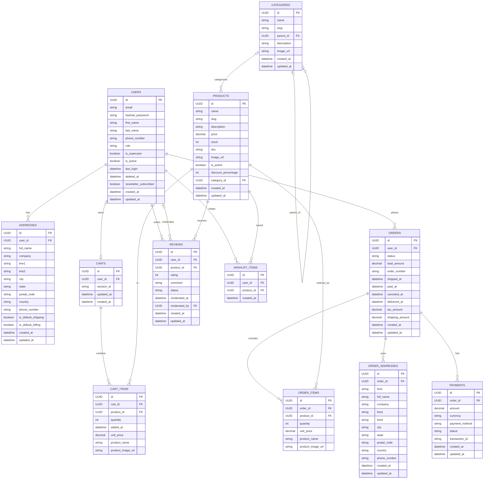

# ER Diagram

Notes:
- Cardinalities reflect nullable/unique constraints in the models (e.g., `Product.category_id` is nullable, `Cart.user_id` is nullable + unique).
- `REVIEWS.moderated_by` is an optional second FK to `USERS`.
